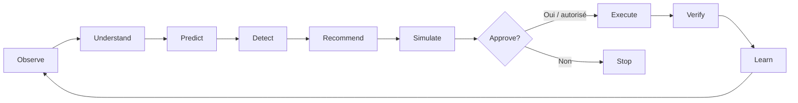
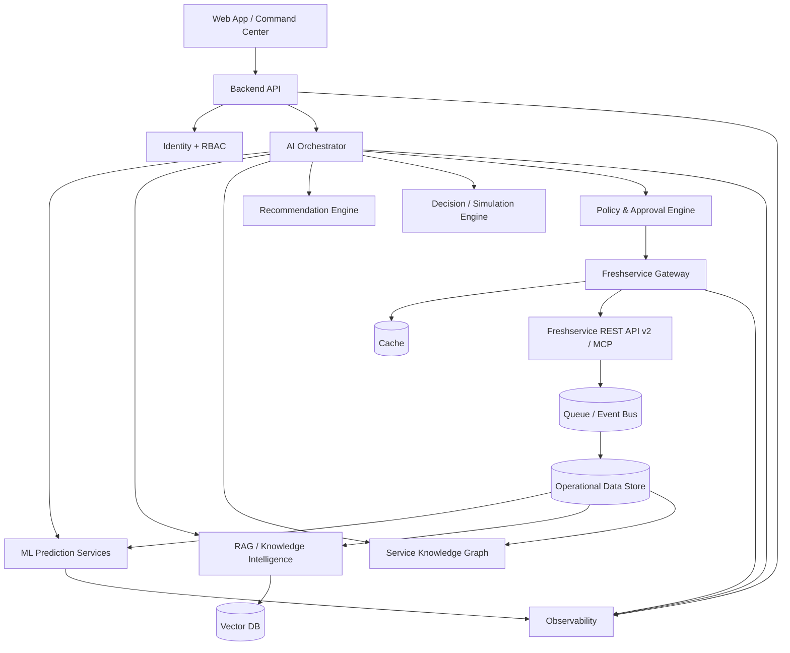
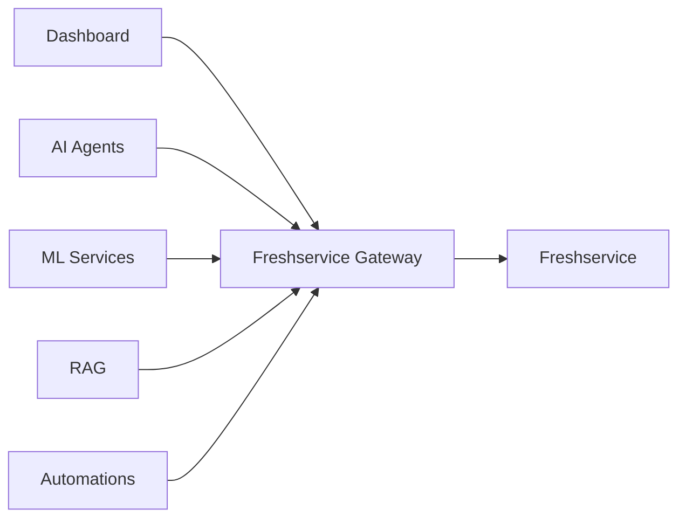

# 🧠 D-Clic Intelligence

> **AI ServiceOps Command Center for Freshservice**  
> Observer → Comprendre → Prédire → Recommander → Simuler → Décider → Agir → Vérifier → Apprendre

D-Clic Intelligence est une **couche d’intelligence opérationnelle au-dessus de Freshservice**.

Freshservice reste le **système de référence** : tickets, utilisateurs, agents, groupes, assets, incidents, problèmes, changements, releases, demandes de service, catalogue, base de connaissances, workflows et autres objets gérés dans Freshservice.

D-Clic Intelligence devient le **cerveau d’aide à la décision et d’automatisation** : il observe l’activité, comprend les situations, détecte les risques, prédit ce qui peut arriver, recommande la meilleure action, demande une validation quand elle est nécessaire, exécute l’action autorisée dans Freshservice puis vérifie le résultat.

---

## 👶 Si j’ai 5 ans

Imagine que **Freshservice est une grande boîte où l’entreprise range tous ses problèmes et toutes ses demandes**.

Quand quelqu’un dit :

> « Mon VPN ne marche plus. »

Freshservice crée un ticket et le range.

D-Clic Intelligence est comme un **robot très intelligent assis à côté de la boîte**.

Le robot peut regarder les tickets et dire :

- « Ces 40 tickets parlent sûrement du même problème. »
- « Celui-ci risque d’être en retard dans deux heures. »
- « Cette équipe a trop de travail. »
- « J’ai déjà vu ce problème 27 fois. Voici la solution. »
- « Un changement réseau réalisé ce matin est peut-être la cause. »
- « Je peux préparer l’action. Est-ce que je l’applique ? »

Si l’humain clique **Appliquer**, D-Clic Intelligence utilise les interfaces officielles de Freshservice pour faire la modification.

**Il ne remplace pas Freshservice. Il le rend plus intelligent.**

---

# 🎯 Vision

Construire un **AI Operating System for Service Management** utilisable en parallèle de Freshservice par tous les acteurs.

| Acteur | Ce que l’outil lui apporte |
|---|---|
| 👤 Utilisateur | réponse, orientation, suivi, self-service, prévention des demandes inutiles |
| 🎧 Agent | compréhension, priorisation, classification, solution, réponse, automatisation |
| 🧑‍💼 Manager | prévision SLA, charge, capacité, risques, incidents majeurs, performance |
| 🛠️ Admin | gouvernance, quotas API, règles, modèles, intégrations, permissions |
| 🧠 Expert métier | validation de connaissances, règles et recommandations |
| 🔐 Sécurité / DPO | contrôle d’accès, audit, traçabilité, minimisation des données |
| 📊 Direction | risques, qualité de service, gains, capacité, tendances |

---

# 🧩 La boucle intelligente

> **Observe → Understand → Predict → Detect → Recommend → Simulate → Approve → Execute → Verify → Learn**

---

# 🚫 Ce que le projet n’est PAS

D-Clic Intelligence n’est pas :

- un simple chatbot ;
- une copie de Freshservice ;
- un script qui modifie des tickets sans contrôle ;
- un LLM relié directement à une clé API ;
- une collection de prompts ;
- un dashboard passif ;
- une IA qui a tous les droits ;
- une architecture où chaque projet appelle Freshservice de son côté.

---

# 🧠 Les 7 cerveaux

1. **UNDERSTAND** — comprendre tickets, demandes, conversations et contexte.
2. **PREDICT** — prévoir SLA, temps de résolution, volumes, charge et risques.
3. **DETECT** — trouver anomalies, doublons, clusters et incidents émergents.
4. **RECOMMEND** — proposer la meilleure action, solution ou affectation.
5. **DECIDE** — comparer les scénarios et mesurer leurs conséquences.
6. **ACT** — exécuter les actions autorisées dans Freshservice.
7. **LEARN** — apprendre des décisions, corrections et résultats réels.

---

# 🏗️ Architecture cible

---

# 🛡️ Autonomie contrôlée

| Niveau | Comportement | Exemple |
|---|---|---|
| L0 | Observer | détecter un risque SLA |
| L1 | Recommander | proposer une priorité |
| L2 | Préparer + faire valider | préparer une réaffectation |
| L3 | Exécuter automatiquement sous règles | ajouter un tag fiable |
| L4 | Bloqué | action sensible interdite |

L’autonomie est définie **par action**, **par rôle**, **par environnement**, **par score de confiance** et **par politique métier**.

---

# 🔌 Freshservice Gateway obligatoire

Aucun composant IA n’appelle Freshservice directement.

Le Gateway centralise :

- authentification ;
- autorisation ;
- rate limiting ;
- sous-limites par opération ;
- cache ;
- file d’attente ;
- priorité ;
- retry ;
- exponential backoff ;
- gestion HTTP 429 ;
- idempotence ;
- déduplication ;
- circuit breaker ;
- audit ;
- métriques ;
- coût d’appel ;
- contrôle de concurrence.

---

# 🔌 REST API v2 + MCP

D-Clic Intelligence utilise deux voies complémentaires.

### REST API v2
Voie déterministe principale pour la couverture des objets et opérations supportées par Freshservice.

### Freshservice MCP
Voie agentique contrôlée lorsque le MCP est disponible et autorisé.

> Le produit ne dépend **jamais exclusivement du MCP**.

Au 11 juin 2026, Freshservice documente son MCP comme **Beta / Early Access Program** pour certains clients Enterprise. Cette disponibilité peut évoluer : le Gateway doit donc abstraire le canal d’exécution.

---

# 📚 Documentation

| Document | Contenu |
|---|---|
| [docs/00-START-HERE.md](docs/00-START-HERE.md) | explication ultra-simple |
| [docs/01-PRODUCT-VISION.md](docs/01-PRODUCT-VISION.md) | vision produit et objectifs |
| [docs/02-SYSTEM-ARCHITECTURE.md](docs/02-SYSTEM-ARCHITECTURE.md) | architecture technique |
| [docs/03-AI-CAPABILITIES.md](docs/03-AI-CAPABILITIES.md) | catalogue des capacités IA |
| [docs/04-FRESHSERVICE-INTEGRATION.md](docs/04-FRESHSERVICE-INTEGRATION.md) | API v2, MCP, synchronisation |
| [docs/05-DATA-ML-ARCHITECTURE.md](docs/05-DATA-ML-ARCHITECTURE.md) | données, ML, RAG, GraphRAG |
| [docs/06-SECURITY-GOVERNANCE.md](docs/06-SECURITY-GOVERNANCE.md) | sécurité et gouvernance |
| [docs/07-OBSERVABILITY.md](docs/07-OBSERVABILITY.md) | monitoring complet |
| [docs/08-USER-JOURNEYS.md](docs/08-USER-JOURNEYS.md) | parcours utilisateur/agent/admin |
| [docs/09-ROADMAP.md](docs/09-ROADMAP.md) | roadmap de construction |
| [docs/10-GLOSSARY.md](docs/10-GLOSSARY.md) | glossaire simple |
| [docs/11-API-GATEWAY-SPEC.md](docs/11-API-GATEWAY-SPEC.md) | spécification du Gateway |
| [docs/12-MVP-ACCEPTANCE-CRITERIA.md](docs/12-MVP-ACCEPTANCE-CRITERIA.md) | définition précise du premier MVP |

---

# 📏 Principes d’ingénierie

1. Freshservice reste la source de vérité.
2. Aucun LLM n’accède directement à Freshservice.
3. Toute action passe par une policy.
4. Toute action sensible est auditable.
5. Toute prédiction possède un score et une incertitude.
6. Une prédiction n’est jamais présentée comme une certitude.
7. Les modèles sont monitorés comme les API.
8. Les quotas API sont une ressource partagée à gérer.
9. Le système doit être résilient à la panne d’un fournisseur IA.
10. L’humain garde le contrôle sur les décisions à fort impact.
11. Les actions doivent être idempotentes ou protégées contre les doublons.
12. Les automatisations doivent être réversibles lorsque c’est possible.
13. Les données récupérées sont minimisées.
14. Une fonctionnalité IA doit avoir un indicateur de valeur métier.
15. La simplicité utilisateur est une exigence d’architecture.

---

# 🚀 Phase actuelle

**Phase 0 — Fondation, architecture et documentation.**

Premier vertical slice à démontrer :

1. connexion sécurisée à Freshservice ;
2. lecture d’un ticket ;
3. stockage/synchronisation minimale ;
4. analyse IA ;
5. recommandation ;
6. policy check ;
7. validation humaine ;
8. exécution dans Freshservice ;
9. vérification du résultat ;
10. audit complet.

Ce flux prouve la philosophie entière du produit avant d’ajouter des dizaines de modules.

---

# 📌 Références officielles Freshservice

- API v2 : https://api.freshservice.com/v2/
- Working with APIs : https://support.freshservice.com/support/solutions/articles/50000012704-working-with-apis-in-freshservice
- MCP Integration : https://support.freshservice.com/support/solutions/articles/50000012678-model-context-protocol-mcp-integration-in-freshservice
- Data Usage Analytics : https://support.freshservice.com/support/solutions/articles/50000014074-data-usage-analytics
