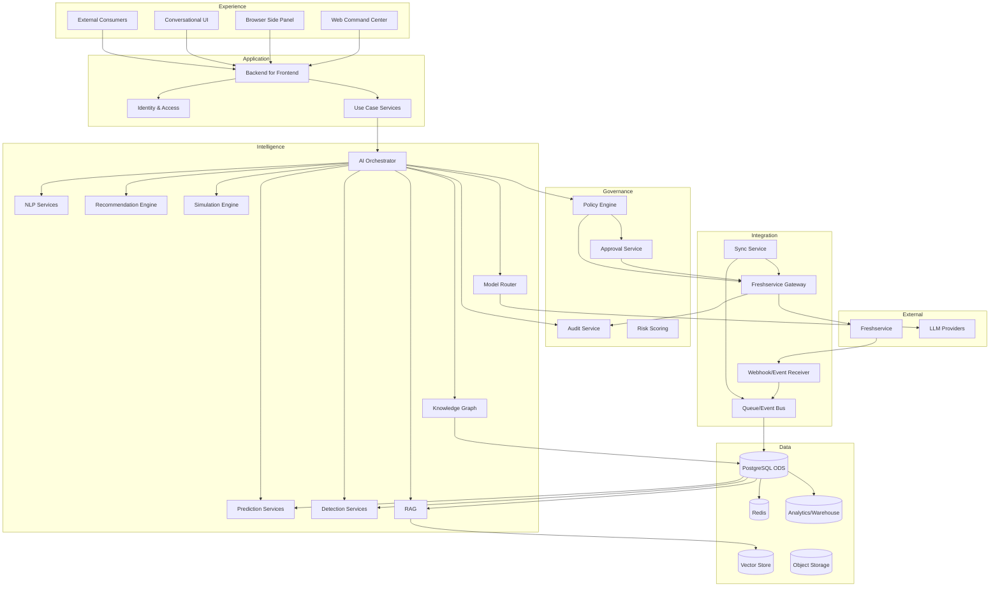
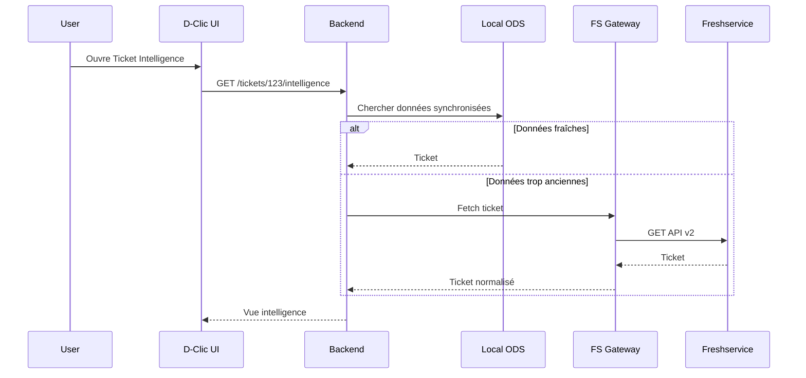
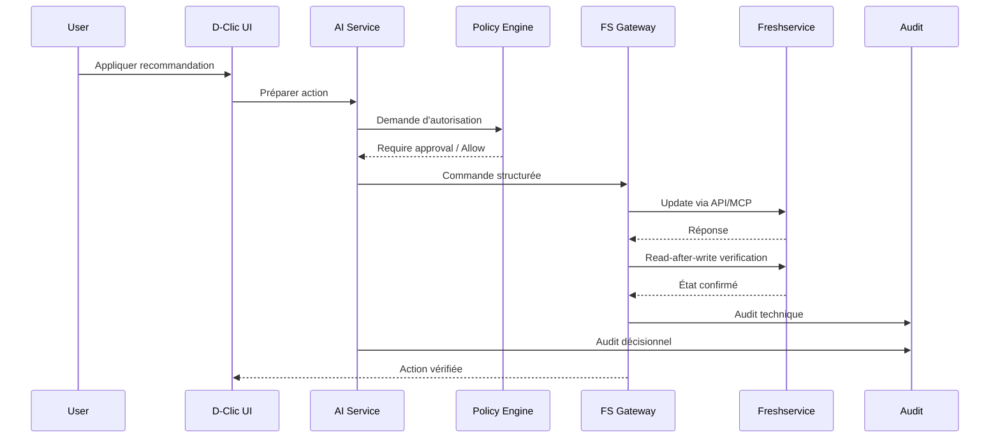

# 02 — System Architecture

## Objectif

Définir une architecture capable de supporter :

- interfaces multi-rôles ;
- opérations Freshservice ;
- modèles ML ;
- LLM ;
- RAG ;
- GraphRAG ;
- agents ;
- règles ;
- simulation ;
- monitoring ;
- audit ;
- forte croissance fonctionnelle.

---

# 1. Architecture logique



---

# 2. Experience Layer

La couche expérience contient les interfaces.

## 2.1 Command Center
Application web principale.

Pages possibles :

- Overview ;
- Tickets Intelligence ;
- SLA Risk ;
- Incident Radar ;
- Workload ;
- Changes ;
- Knowledge ;
- AI Actions ;
- Approvals ;
- Automations ;
- API Control ;
- Models ;
- Audit ;
- Admin.

## 2.2 Side Panel
À terme, une extension ou panneau latéral peut être utilisé en même temps que Freshservice.

Objectif :

- l’agent reste dans son environnement ;
- il voit les recommandations D-Clic ;
- il clique ;
- Freshservice est modifié ;
- le résultat est visible immédiatement.

## 2.3 Conversational Command Bar
Permet des commandes telles que :

> « Montre-moi les tickets VPN critiques créés depuis ce matin. »

Cette interface ne doit pas exécuter directement. Elle produit une **intention structurée**.

---

# 3. Application Layer

## 3.1 BFF / Backend API

Responsabilités :

- exposer les endpoints à l’UI ;
- gérer sessions ;
- agréger plusieurs services ;
- renvoyer des view models stables ;
- ne pas exposer les secrets Freshservice au navigateur.

## 3.2 Use Case Services

On préfère des services organisés par cas d’usage :

- TicketIntelligenceService ;
- SlaRiskService ;
- IncidentRadarService ;
- WorkloadService ;
- ChangeRiskService ;
- KnowledgeService ;
- ActionService.

Cela évite que le frontend orchestre lui-même 12 APIs.

---

# 4. Intelligence Layer

## 4.1 AI Orchestrator

Le rôle de l’orchestrateur est de transformer une demande complexe en plan.

Exemple :

> « Analyse les tickets VPN et propose un plan. »

Plan interne possible :

1. rechercher les tickets ;
2. enrichir avec les conversations ;
3. calculer embeddings ;
4. détecter clusters ;
5. récupérer changements récents ;
6. rechercher dans la KB ;
7. produire une synthèse ;
8. produire des actions candidates ;
9. calculer leur risque ;
10. demander une policy decision.

L’orchestrateur n’est **pas le détenteur des permissions**.

---

## 4.2 Model Router

Tous les appels LLM passent par un routeur.

Il décide selon :

- sensibilité ;
- coût ;
- latence ;
- taille de contexte ;
- disponibilité ;
- qualité attendue ;
- souveraineté / zone d’hébergement ;
- tâche.

Exemple :

- modèle petit : classification légère ;
- modèle spécialisé : embeddings ;
- modèle puissant : synthèse complexe ;
- aucun LLM : règles déterministes.

---

## 4.3 ML Services

Services indépendants pour :

- classification ;
- SLA risk ;
- resolution time ;
- assignment ;
- volume forecast ;
- workload forecast ;
- change risk ;
- anomaly detection ;
- duplicate detection.

---

# 5. Governance Layer

Cette couche est volontairement séparée de l’intelligence.

Pourquoi ?

Parce qu’un modèle peut dire :

> « Fermer le ticket est probablement la bonne action. »

Mais la policy peut répondre :

> « Interdit sans validation humaine. »

## Policy decision

Entrée :

```json
{
  "actor": "agent_123",
  "action": "ticket.close",
  "resource": "ticket_987",
  "ai_confidence": 0.96,
  "risk": "high",
  "environment": "production"
}
```

Sortie :

```json
{
  "decision": "require_approval",
  "policy": "P-TICKET-CLOSE-001",
  "reason": "High-impact action requires human approval"
}
```

---

# 6. Integration Layer

## 6.1 Freshservice Gateway
Point d’entrée unique vers Freshservice.

## 6.2 Sync Service
Synchronise les objets nécessaires.

## 6.3 Event Receiver
Réception des événements/webhooks disponibles.

## 6.4 Queue
Découple ingestion, IA et exécution.

---

# 7. Data Layer

## Operational Data Store
Copie locale limitée et gouvernée des données utiles aux cas d’usage.

Le but n’est pas de remplacer Freshservice.

Le but est de :

- éviter de relire sans cesse les mêmes données ;
- créer des features ML ;
- calculer tendances ;
- rechercher rapidement ;
- historiser des signaux nécessaires.

## Cache
Pour données fréquemment consultées à courte durée de vie.

## Vector Store
Pour embeddings et recherche sémantique.

## Analytics Warehouse
Pour analyses longues, BI, suivi historique.

---

# 8. Flux lecture



---

# 9. Flux écriture



---

# 10. Résilience

## Défaillance Freshservice
- circuit breaker ;
- queue des actions non urgentes ;
- mode lecture sur données locales si acceptable ;
- aucune fausse confirmation.

## Défaillance LLM
- fallback provider ;
- modèle local si pertinent ;
- fonctions déterministes continuent ;
- pas d’impact sur le Gateway.

## Défaillance ML
- feature flag ;
- retour à règles ;
- marquer la prédiction indisponible.

## Défaillance base locale
- ne pas basculer automatiquement vers une rafale d’appels Freshservice ;
- appliquer un quota de sécurité.

---

# 11. Déploiement recommandé

Au début : **modular monolith + workers**, pas 25 microservices.

Pourquoi ?

- plus simple à développer ;
- observabilité plus facile ;
- moins de réseau ;
- moins de DevOps ;
- possibilité d’extraire un service quand sa charge le justifie.

Composants initiaux :

1. frontend ;
2. backend ;
3. worker ;
4. PostgreSQL ;
5. Redis ;
6. vector store ;
7. observability stack.

Puis extraction progressive de :

- Gateway ;
- prediction services ;
- ingestion ;
- orchestration.

---

# 12. Règle architecturale

> **Le chemin de décision et le chemin d’exécution doivent être séparés.**

Une IA peut proposer beaucoup de choses.

Le système d’exécution n’accepte que des **commandes structurées, validées et autorisées**.
