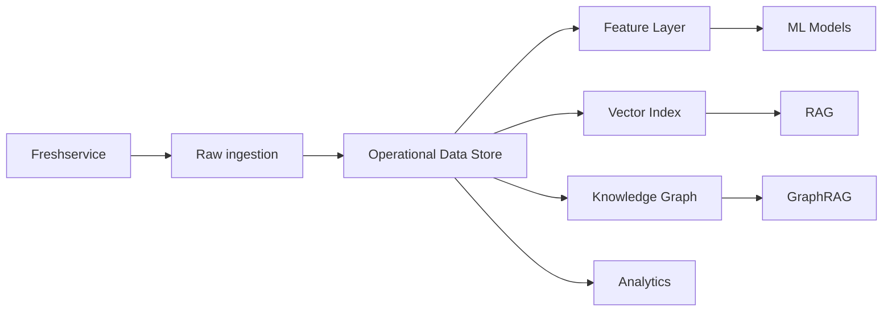

# 05 — Data & ML Architecture

# 1. But

Transformer les données opérationnelles en signaux exploitables sans créer un « deuxième Freshservice ».

---

# 2. Couches de données



---

# 3. Raw ingestion

Conserver temporairement les événements ou réponses brutes nécessaires pour :

- débogage ;
- reproductibilité ;
- parsing ;
- audit technique.

Attention :
ne pas conserver des données sensibles « juste au cas où ».

---

# 4. ODS

Tables possibles :

- tickets ;
- ticket_conversations ;
- users ;
- agents ;
- groups ;
- assets ;
- problems ;
- changes ;
- releases ;
- kb_articles ;
- sync_state ;
- ai_recommendations ;
- action_commands ;
- approvals ;
- audit_events.

---

# 5. Feature layer

Une feature est une information calculée utilisée par un modèle.

Exemples ticket :

- ticket_age_minutes ;
- replies_count ;
- assignment_changes_count ;
- time_since_last_agent_reply ;
- requester_ticket_count_30d ;
- group_backlog ;
- text_embedding ;
- similar_incident_count_2h ;
- remaining_sla_minutes.

Les définitions doivent être versionnées.

---

# 6. Temporal correctness

Pour prédire le passé comme si on y était, il faut éviter les fuites de données.

Mauvais exemple :

Prédire à 10:00 un SLA breach avec une feature calculée à 14:00.

Cette erreur donne des modèles artificiellement excellents.

Utiliser :
- event time ;
- snapshot temporel ;
- feature timestamp.

---

# 7. Classification

Architecture recommandée :

1. baseline TF-IDF + modèle linéaire ;
2. transformer ;
3. hiérarchie ;
4. contraintes métier ;
5. calibration ;
6. top-k ;
7. abstention.

### Abstention

Si confiance trop faible :

> « Je ne suis pas suffisamment sûr. Voici les trois options. »

C’est mieux qu’une mauvaise automatisation.

---

# 8. SLA model

Dataset :
un exemple par ticket ou snapshot.

Label :
SLA violated yes/no.

Attention aux tickets encore ouverts : gestion de censure selon le modèle choisi.

Évaluation :
- split temporel ;
- calibration curve ;
- recall à un taux d’alerte acceptable ;
- lead time.

---

# 9. Forecasting

Forecast par séries :

- tickets entrants ;
- groupe ;
- catégorie ;
- heure/jour.

Baseline avant deep learning :
- seasonal naive ;
- moving average ;
- ETS ;
- modèles classiques.

Le deep learning n’est utile que s’il apporte un gain.

---

# 10. Embeddings

Utilisations :
- similar tickets ;
- clustering ;
- semantic search ;
- KB matching.

Bonnes pratiques :
- versionner le modèle d’embedding ;
- versionner la dimension ;
- reindexer lors d’un changement important ;
- stocker l’identifiant de modèle ;
- ne pas comparer aveuglément des vecteurs produits par des modèles différents.

---

# 11. RAG

Pipeline :

```text
Question
  ↓
Intent
  ↓
Retrieval
  ↓
Reranking
  ↓
Context filtering
  ↓
LLM
  ↓
Answer + sources + confidence signals
```

Sources autorisées :
- KB validée ;
- procédures ;
- tickets selon droits ;
- résolutions ;
- documentation interne autorisée.

---

# 12. RAG guardrails

Vérifier :

- nombre de documents ;
- scores ;
- couverture ;
- fraîcheur ;
- droits ;
- conflit entre sources.

Si contexte insuffisant :

> « Je n’ai pas assez de sources fiables pour répondre. »

---

# 13. Knowledge Graph

Nœuds :

- Ticket ;
- User ;
- Agent ;
- Group ;
- Asset ;
- Service ;
- Problem ;
- Change ;
- KB Article ;
- Location.

Relations :

```text
Ticket --reported_by--> User
Ticket --assigned_to--> Group
Ticket --affects--> Asset
Ticket --related_to--> Problem
Problem --possibly_caused_by--> Change
Asset --supports--> Service
KB --solves--> IssueType
```

---

# 14. GraphRAG

Question :

> « Pourquoi les tickets VPN de Rouen ont augmenté après le changement ? »

Le système peut combiner :
- similarité textuelle ;
- changements ;
- assets ;
- lieux ;
- dépendances.

Le graphe apporte des relations structurées que le texte seul ne montre pas.

---

# 15. Recommendation Store

Toute recommandation doit être persistée.

```json
{
  "recommendation_id": "rec-123",
  "type": "ticket.assignment",
  "target_id": "18492",
  "proposed_value": "group-workplace",
  "confidence": 0.91,
  "model_version": "assignment-v3",
  "created_at": "...",
  "status": "accepted"
}
```

C’est indispensable pour mesurer la qualité.

---

# 16. Feedback

Types :

- accept ;
- reject ;
- edit ;
- undo ;
- implicit success ;
- implicit failure.

Une correction humaine ne doit pas être injectée directement en training sans contrôle.

Pipeline :

```text
Feedback
  ↓
Quality checks
  ↓
Label review
  ↓
Dataset version
  ↓
Training
```

---

# 17. MLOps

Chaque modèle :

- code versionné ;
- dataset versionné ;
- config versionnée ;
- métriques ;
- artefact ;
- registry ;
- staging ;
- production ;
- rollback.

---

# 18. Model monitoring

Surveiller :

- input drift ;
- prediction drift ;
- performance delayed labels ;
- calibration ;
- coverage ;
- abstention rate ;
- latency ;
- errors.

---

# 19. LLMOps

Tracer sans exposer inutilement de données :

- use case ;
- modèle ;
- version ;
- tokens ;
- durée ;
- coût ;
- retrieval IDs ;
- policy outcome ;
- structured output validation ;
- erreur.

Ne pas loguer aveuglément tous les prompts en clair si des données personnelles sont présentes.

---

# 20. Evaluation LLM

Créer un golden set.

Dimensions :
- factualité ;
- pertinence ;
- grounding ;
- format ;
- sécurité ;
- action correctness.

Un joli texte n’est pas une bonne évaluation.

---

# 21. Champion / Challenger

Exemple :

- production : Model A ;
- challenger : Model B en shadow ;
- comparer les décisions ;
- promouvoir seulement après validation.

---

# 22. Data retention

Pour chaque dataset :

- purpose ;
- owner ;
- source ;
- retention ;
- sensitivity ;
- deletion process ;
- legal basis selon contexte ;
- access groups.

La plateforme Data doit être aussi gouvernée que Freshservice.
